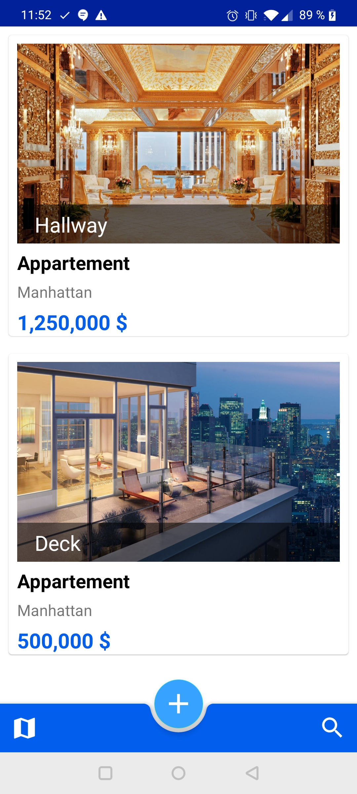
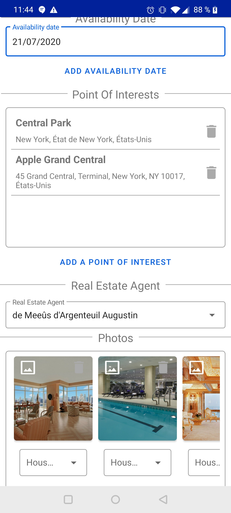
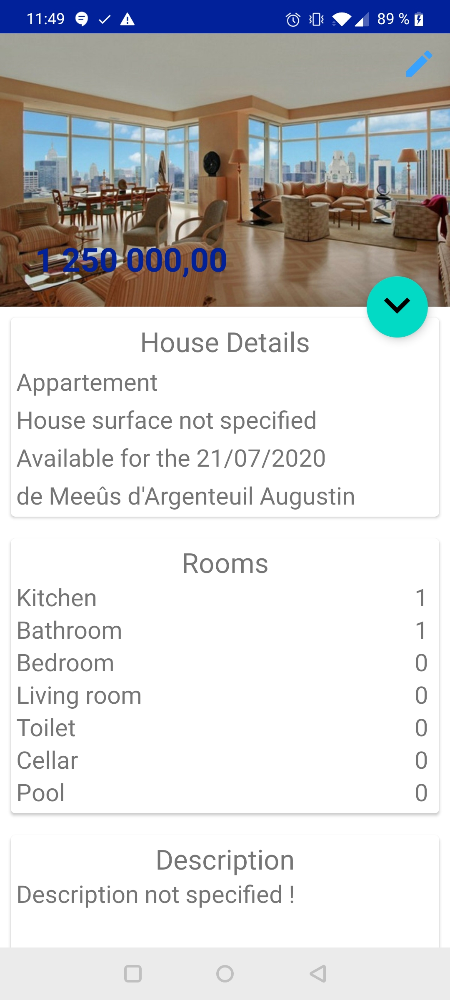
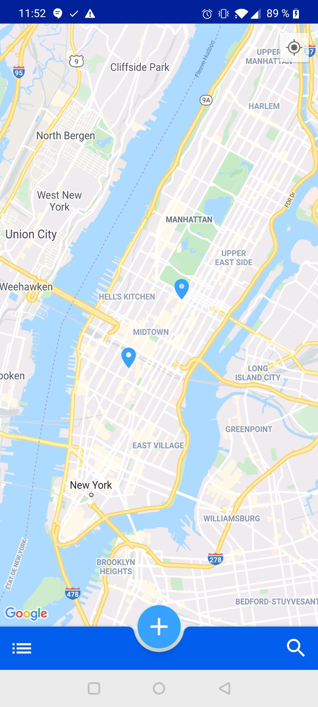

# RealEstateManager

    

## Description

This app is developed for a real estate agency. This agency is specialized in selling exceptional property such as duplexes, lofts, penthouses … 
So far, the administrative aspect of this agency has been fulfilled with outdated techniques relative to the 19th century: paper files and pencils. It was high time digitalize the paperwork (it’s more practical and ecological). The board asked to develop a Mobile Application which allows the real estate agent to access each property from their mobile devices. 

## API used

- Room & Room Testing
- Data Binding
- Places (Places API & Nearby Places Search API)
- Retrofit 2
- RxJava
- Range Seekbar
- Picasso
- ExoPlayer
